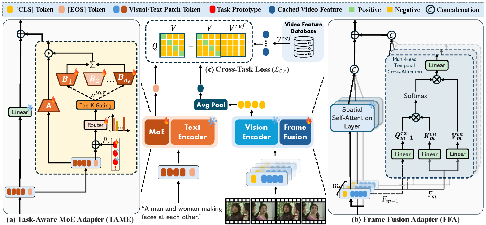
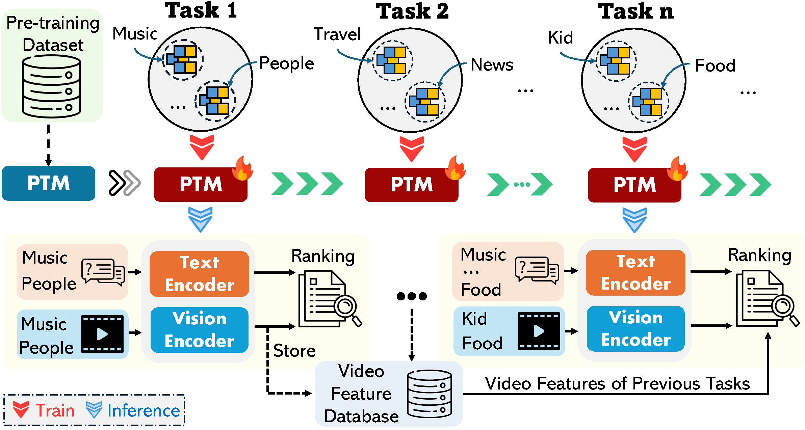

# Continual Text-to-Video Retrieval with Frame Fusion and Task-Aware Routing

[](https://sigir2025.dei.unipd.it/) [](https://arxiv.org/abs/2503.10111)


This repository contains the official implementation of our SIGIR 2025 paper: "[Continual Text-to-Video Retrieval with Frame Fusion and Task-Aware Routing]()".



## Table of Contents
- [Overview](#overview)
- [Installation](#installation)
- [Data Preparation](#data-preparation)
- [FrameFusionMoE Model](#framefusionmoe-model)
- [CTVR Benchmark](#ctvr-benchmark)
- [Baseline Models](#baseline-models)
- [Results](#results)
- [Project Structure](#project-structure)
- [Citation](#citation)
- [Acknowledgments](#acknowledgments)

## Overview

This repository provides two main components:

### 1. FrameFusionMoE Model

FrameFusionMoE is our solution to the CTVR challenge, designed to:

- Adapt to new video categories without forgetting previously learned ones
- Maintain high retrieval performance across all learned categories
- Operate efficiently in a practical scenario where video features are stored in a database

#### Key Components:

- **Frame Fusion Adapter**: Processes video frames while preserving compatibility with CLIP
- **Task-Aware Mixture-of-Experts**: Routes queries to appropriate experts based on content
- **Cross-Task Loss**: Prevents forgetting by maintaining alignments for previous tasks

### 2. Continual Text-to-Video Retrieval (CTVR) Benchmark

The CTVR benchmark is the first standardized environment for evaluating how video retrieval systems adapt to new video content over time. It features:

- Task sequences with 10 or 20 distinct categories on MSRVTT and ActivityNet datasets
- Support for diverse baseline methods (TVR and CL approaches)

## Installation

```bash
# Create a new conda environment
conda create -n framefusionmoe python=3.8
conda activate framefusionmoe

# Install PyTorch with CUDA
pip install torch==2.4.1 torchvision==0.19.1 torchaudio==2.4.1 --index-url https://download.pytorch.org/whl/cu118

# Install other dependencies
pip install ftfy regex tqdm opencv-python pandas matplotlib scikit-learn transformers==4.18.0
```

## Data Preparation

### MSRVTT Dataset

```bash
# Download MSRVTT data
wget https://www.robots.ox.ac.uk/~maxbain/frozen-in-time/data/MSRVTT.zip
unzip MSRVTT.zip -d datasets/MSRVTT

# Place videos in datasets/MSRVTT/MSRVTT_Videos
# Process video frames
python datasets/utils/process_msrvtt.py
```

### ActivityNet Dataset

```bash
# Download ActivityNet data from official website
# save it in datasets/ACTNET
# http://activity-net.org/download.html

# Place videos in datasets/ACTNET/Activity_Videos
# Process video clips
python datasets/utils/process_actnet.py
```

### CTVR Dataset Configuration

Each CTVR setup distributes categories uniformly across tasks:

| Setup | Dataset | #Tasks | Categories per Task |
|-------|---------|--------|---------------------|
| [MSRVTT_10_dataset.pkl](https://drive.google.com/drive/folders/1CEDErqIN9OM_koxkzaE-pgBRK6vwYZw3?usp=sharing) | MSRVTT | 10 | 2 |
| [MSRVTT_20_dataset.pkl](https://drive.google.com/drive/folders/1yrNtTr6eWtZ1a7cvyUP4uqwVstYm26lt?usp=sharing) | MSRVTT | 20 | 1 |
| [ACTNET_10_dataset.pkl](https://drive.google.com/drive/folders/1NwpGOSjc0cALW1UXpFdjKeGm0FSlzllx?usp=sharing) | ActivityNet | 10 | 20 |
| [ACTNET_20_dataset.pkl](https://drive.google.com/drive/folders/1AJlf0-eZgo3ZPmkCYJoMv7urH4ZpTW3n?usp=sharing) | ActivityNet | 20 | 10 |

## FrameFusionMoE Model

### Training

To train FrameFusionMoE, use the provided shell script for a one-command setup. For example, to train on MSRVTT with 10 tasks:

```bash
bash scripts/train_framefusionmoe.sh
```

You can adjust dataset, data paths, and other parameters by editing `scripts/train_framefusionmoe.sh`.

### Evaluation

FrameFusionMoE supports two evaluation modes:

- **Single-task Evaluation (`--eval_mode="single"`):**  
  Evaluates the model after learning a specific task, measuring final retrieval performance and catastrophic forgetting.

  To run single-task evaluation:

  ```bash
  bash scripts/eval_framefusionmoe_single.sh
  ```

- **Multi-task Evaluation (`--eval_mode="all"`):**  
  Evaluates the model on all learned tasks, from task 1 to the final task. 

  To run multi-task evaluation:

  ```bash
  bash scripts/eval_framefusionmoe_multi.sh
  ```


For more details and additional dataset/task settings, see the scripts in the `scripts/` directory.

**Key Parameters:**
- `--config`: Path to the configuration file
- `--dataset_name`: Dataset name (e.g., MSRVTT, ACTNET)
- `--path_data`: Path to the continual dataset file
- `--videos_dir`: Directory containing video frames
- `--arch`: Model architecture (eg.`frame_fusion_moe`)
- `--seed`: Random seed for reproducibility
- `--task_num` / `--eval_task_id`: Task number (e.g., 10 or 20)
- `--eval_mode`: Evaluation mode ("all" for multi-task, "single" for single-task)
- `--eval_path`: Path to the trained model checkpoint


## CTVR Benchmark

> **TODO**: This section will be updated with detailed instructions for running the benchmark.



*Illustration of Continual Text-to-Video Retrieval (CTVR) pipeline. A Pre-Trained Model (PTM) continuously adapts to a sequence of TVR tasks through continual learning. Video features extracted in the current task are stored in a database and leveraged for subsequent tasks.*

## Baseline Models

The following baseline models are included for comparison:

```bash
# Train baseline models (e.g., CLIP4Clip/AvgPool)
ToDO: Add commands for training baseline models
```

### Available Models

The following models can be specified using the `--model` parameter:

ToDO: Add available models

### Dataset Options

- `--dataset_name msrvtt`: MSRVTT dataset
- `--dataset_name actnet`: ActivityNet dataset
- `--num_tasks [10|20]`: Number of sequential tasks

## Results

### CTVR Benchmark Results


#### MSRVTT Dataset (R@1)

| Method | 10 Tasks↑ | BWF↓ | 20 Tasks↑ | BWF↓ | Params |
| --- | --- | --- | --- | --- | --- |
| Zero-Shot CLIP | 22.14 | 0.00 | 22.14 | 0.00 | 0.00M |
| CLIP4Clip | 23.57 | 0.61 | 21.79 | 1.02 | 151.28M |
| X-Pool | 19.60 | 0.28 | 15.98 | 1.37 | 152.59M |
| CLIP-ViP | 21.56 | 0.49 | 19.74 | 0.73 | 151.29M |
| LwF | 23.85 | 1.68 | 22.06 | 1.65 | 151.28M |
| VR-LwF | 24.49 | 1.22 | 22.39 | 1.44 | 151.28M |
| ZSCL | 23.99 | 0.10 | 21.47 | 0.91 | 151.28M |
| MoE-Adapter | 22.92 | 0.14 | 22.70 | 0.01 | 59.80M |
| **FrameFusionMoE (Ours)** | **25.87** | **-0.45** | **25.16** | **-0.70** | **46.80M** |

#### ActivityNet Dataset (R@1)

| Method | 10 Tasks↑ | BWF↓ | 20 Tasks↑ | BWF↓ | Params |
| --- | --- | --- | --- | --- | --- |
| Zero-Shot CLIP | 14.89 | 0.00 | 14.89 | 0.00 | 0.00M |
| CLIP4Clip | 17.85 | 0.75 | 17.07 | 0.45 | 151.28M |
| X-Pool | 17.99 | 0.37 | 16.57 | 0.31 | 152.59M |
| CLIP-ViP | 17.01 | 0.56 | 16.02 | 0.73 | 151.29M |
| LwF | 17.56 | 0.63 | 16.36 | 0.93 | 151.28M |
| VR-LwF | 18.08 | 0.68 | 17.21 | 0.58 | 151.28M |
| ZSCL | 17.67 | 0.35 | 16.83 | 0.70 | 151.28M |
| MoE-Adapter | 16.63 | -0.15 | 15.77 | -0.01 | 59.80M |
| **FrameFusionMoE (Ours)** | **18.21** | **-0.01** | **17.71** | **0.04** | **46.80M** |

## Project Structure

The project is organized as follows:

```
.
├── config/                        # Configuration files
├── data/                          # CTVR data 
├── datasets/                      # Dataset management
│   ├── ACTNET/                    # ActivityNet dataset
│   │   ├── Activity_Clip_Frames/  
│   │   └── Activity_Videos/
│   ├── MSRVTT/                    # MSRVTT dataset
│   │   ├── MSRVTT_Frames/         
│   │   └── MSRVTT_Videos/
│   └── utils/                     # Data preprocessing utilities
├── evaluator/                     # Evaluation metrics and utilities
├── model/                         # Model implementations
├── modules/                       # Core modules
├── outputs/                       # Results and model checkpoints
├── scripts/                       # Training/Evulation scripts
├── trainer/                       # Training management code
├── main.py                        # Main entry point for training and evaluation
```

## Citation

If you find our work useful, please consider citing our paper:

```
ToDO: Add citation information
```

## Acknowledgments

Our work would not have been possible without these excellent open-source projects:
- [XPool](https://github.com/layer6ai-labs/xpool)
- [vCLIMB](https://github.com/ojedaf/vCLIMB_Benchmark)
